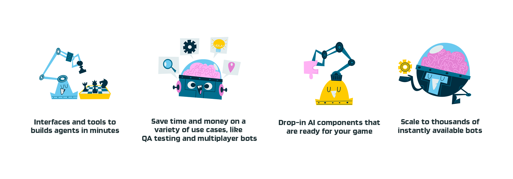

# Regression Games for Unity

Regression Games is developing a platform where studios can **build and deploy bots for a variety of use cases in minutes.** We are designing for scale (deploy thousands of bots), ease of use (e.g. generative AI to build bots), ease of integration (minimal impact on game development time), and feature richness (e.g. A/B bot test for engagement).



## Current Stage of the Product

This product is currently a **release preview**. We are actively talking with studios and game developers to discover the best features and use cases to tackle, and we're making changes frequently.

The team has focused on the foundation of supporting use cases and initial infrastructure to get bots to connect to Unity. The bulk
of our value will come from the interfaces to build bots, the scale of our infrastructure, the speed of integration, and the products
built around these bots.


## Availability Assurances

The Regression Games team offers the following assurances for our initial testing with developers. Additionally, we have a dedicated Discord server for support, and can also create a Slack Connect channel, giving you direct access to our entire team. For access to
these channels, send an e-mail to [aaron@regression.gg](mailto:aaron@regression.gg).

* A single account can run at least 10 bots concurrently
* The time from requesting a bot to be started to the time it connects to Unity will take less than 10 seconds if the bot is relying on dependencies that are common to most bots. This does not cover bots that may have lots of library dependencies, which may take longer.

## Implemented Features

The table below details and links to documentation for the features implemented on our platform.

| **Feature**                    | **Description**                                                                                                   | **Documentation**                                         |
|--------------------------------|-------------------------------------------------------------------------------------------------------------------|-----------------------------------------------------------|
| Unity C# SDK                   | A C# SDK for implementing bots locally in Unity.                                                                  | [Link](unused-content/creating-bots/csharp/adaptive-bots) |
| Bot Code Generation            | Create bots with low-code tools such as behavior trees powered by GPT.                                            | [Link](unused-content/creating-bots/csharp/agent-builder) |
| Platform and Language Agnostic | Our protocol permits bots to eventually be written in multiple engines and languages.                             | _Docs coming soon_                                        |  

## Importing the Regression Games Unity Bots package

Our package is available via GitHub [here](https://github.com/Regression-Games/RGUnityBots). Import the repository by 
clicking **Add package from git URL** in the **Package Manager** window (this window can be opened
in the **Window > Package Manager** menu) and pasting in the following URL.

```
https://github.com/Regression-Games/RGUnityBots.git?path=src/gg.regression.unity.bots#v0.0.27
```

- Note that this package utilizes TextMeshPro.  If you are prompted by Unity to add TextMeshPro assets to your project, please add them.
- Note that this package installs a dependency of Newtonsoft Json (https://docs.unity3d.com/Packages/com.unity.nuget.newtonsoft-json@3.1/manual/index.html) for serializing/deserializing Json message payloads.
- If your game utilizes Unity's ECS, we now have an extension package available to support it. Install this package after installing the core RGUnityBots package:

```
https://github.com/Regression-Games/RGUnityBots/tree/main/src/gg.regression.unity.bots.ecs#v0.0.27
```


For a full walkthrough on getting started, see the [Building Your First Bot](getting-started/creating-your-first-automated-test) tutorial.
